# Diagrammi Visuali del Sistema Workflow

Diagrammi Mermaid per comprendere visivamente l'architettura e i flussi del sistema workflow.

## Indice

- [Architettura Sistema](#architettura-sistema)
- [Routing Logic](#routing-logic)
- [Esecuzione Workflow](#esecuzione-workflow)
- [MCP Integration](#mcp-integration)
- [Esempi Workflow Popolari](#esempi-workflow-popolari)

---

## Architettura Sistema

### Dual-Mode Supervisor


**Legenda**:
- 🟢 Verde: Workflow mode (predefinito)
- 🔴 Rosa: ReAct mode (autonomo)
- 🟡 Giallo: Decision point

---

### Componenti Sistema


---

## Routing Logic

### Router Decision Flow


---

### Auto-Match Logic


---

## Esecuzione Workflow

### Sequential Workflow

```mermaid
graph LR
    Start([Start]) --> N1[Node 1<br/>researcher]
    N1 --> N2[Node 2<br/>analyst]
    N2 --> N3[Node 3<br/>writer]
    N3 --> End([Output])

    N1 -.->|output| S1[(State)]
    S1 -.->|{node1}| N2
    N2 -.->|output| S2[(State)]
    S2 -.->|{node2}| N3

    style N1 fill:#FFB6C1
    style N2 fill:#87CEEB
    style N3 fill:#98FB98
```

**Esempio**: `report_generation.json`
- Node 1: Research topic
- Node 2: Analyze findings
- Node 3: Write report

---

### Parallel Workflow


**Esempio**: `content_repurposing.json`
- Parallel: 3 writer nodes execute simultaneously
- Sync: Wait for all completions
- Time: max(tweet, linkedin, summary) instead of sum

---

### Conditional Workflow


**Esempio**: `sentiment_routing.json`
- Conditional edges based on sentiment_score
- 3 possible paths depending on sentiment

---

### Iterative Loop Workflow


**Safety**: `iteration_count >= 3` prevents infinite loops

---

## MCP Integration

### MCP Tool Execution Flow

```mermaid
sequenceDiagram
    participant Engine as Workflow Engine
    participant Client as MCP Client
    participant Registry as MCP Registry
    participant Server as MCP Server
    participant DB as External Resource

    Engine->>Engine: Resolve parameters<br/>{table_name} → "users"
    Engine->>Client: call_tool("query_database", params)

    Client->>Registry: get_tool("query_database")
    Registry-->>Client: Tool metadata + server info

    Client->>Registry: get_server_config("corporate")
    Registry-->>Client: URL, status, transport

    Client->>Server: POST /mcp<br/>{"tool": "query_database", "args": {...}}
    Server->>DB: Execute query
    DB-->>Server: Result data
    Server-->>Client: JSON response

    Client-->>Engine: Parsed output
    Engine->>Engine: Save to state.node_outputs["query_data"]
```



---

### Database Query Workflow with MCP


**Esempio**: `data_analysis_report.json`

---

### Parallel MCP + Web Research


**Esempio**: `multi_source_research.json`

---

## Esempi Workflow Popolari

### Competitive Analysis


**Template**: `competitive_analysis.json`

**Trigger patterns**:
- "compare .* with .*"
- ".* vs .*"
- ".*competitive.*analysis.*"

---

### Email Newsletter Pipeline

```mermaid
graph TB
    Start([Weekly Newsletter Request]) --> Research[Research Trends<br/>researcher<br/>timeout: 300s]

    Research --> Analyze[Analyze Relevance<br/>analyst<br/>rank by importance]

    Analyze --> Write[Write Newsletter<br/>writer<br/>format: email HTML]

    Write --> End([Newsletter<br/>+ subject line])

    Research -.->|{topic}| State[(Workflow State)]
    State -.->|{research_trends}| Analyze
    State -.->|{analyze_relevance}| Write

    style Research fill:#FFB6C1
    style Analyze fill:#87CEEB
    style Write fill:#98FB98
```

**Template**: `newsletter_workflow.json` (docs/workflows/examples/)

**Variables**:
- `{topic}`: AI trends
- `{audience}`: tech professionals
- `{tone}`: professional
- `{length}`: 500 words

---

### Quality Assurance Loop


**Safety mechanisms**:
1. Quality threshold (0.85)
2. Max iterations (3)
3. Force publish with disclaimer

---

## State Management

### Workflow State Lifecycle


---

## Dependency Resolution

### DAG Construction

```mermaid
graph TB
    subgraph "Template Nodes"
        N1[Node A<br/>depends_on: []]
        N2[Node B<br/>depends_on: [A]]
        N3[Node C<br/>depends_on: [A]]
        N4[Node D<br/>depends_on: [B, C]]
    end

    subgraph "Execution Plan (DAG)"
        Step1[Step 1: Sequential<br/>Execute A]
        Step2[Step 2: Parallel<br/>Execute B || C]
        Step3[Step 3: Sequential<br/>Execute D]
    end

    N1 --> Step1
    N2 --> Step2
    N3 --> Step2
    N4 --> Step3

    Step1 --> Step2
    Step2 --> Step3

    style Step2 fill:#FFD700
```

**Algorithm**: Topological sort with parallel group detection

---

## Variable Substitution

### Substitution Flow


**Priority**:
1. `node_outputs[var]` (output nodi precedenti)
2. `workflow_params[var]` (parametri utente)
3. Error if not found

---

## Performance Comparison

### Sequential vs Parallel Execution

```mermaid
gantt
    title Execution Time Comparison
    dateFormat X
    axisFormat %s

    section Sequential
    Node A (60s) :0, 60s
    Node B (40s) :60s, 100s
    Node C (30s) :100s, 130s

    section Parallel
    Node A (60s) :0, 60s
    Node B (40s) :crit, 0, 40s
    Node C (30s) :crit, 0, 30s
```

**Sequential**: 60s + 40s + 30s = **130s**
**Parallel**: max(60s, 40s, 30s) = **60s**
**Risparmio**: **54%**

---

## Legend

### Simboli Comuni


**Colori**:
- 🟢 Verde: Start/Success
- 🔵 Blu: Processing
- 🟡 Giallo: Decision/Conditional
- 🔴 Rosso: Sync/Critical
- 🟣 Viola: MCP Tools
- 🌸 Rosa: Research/External

---

## Prossimi Passi

- [Cookbook →](05_cookbook.md) - Esempi pratici pronti all'uso
- [Migration Guide →](06_migration_guide.md) - Strategia migrazione ibrida
- [Creating Templates ←](01_creating_templates.md) - Crea i tuoi workflow

---

**Tip**: Usa [Mermaid Live Editor](https://mermaid.live/) per modificare/testare diagrammi.
