# Database Query Intelligence Project

**Version**: 1.0.0
**Status**: Active
**Created**: 2025-10-07

---

## Overview

This project demonstrates **intelligent query routing** in a multi-agent system, seamlessly combining:
- **Corporate database queries** via MCP (Model Context Protocol)
- **Web research** for current information
- **Multi-agent analysis** for synthesis and reporting

The system intelligently analyzes user requests and routes them to the most appropriate resources, providing comprehensive, accurate, and actionable responses.

---

## Key Features

### 🎯 Intelligent Routing
- **Automatic classification** of query types (database, web, hybrid, analysis)
- **Smart tool selection** based on request intent
- **Seamless combination** of multiple data sources

### 🗄️ Database Integration (MCP)
- **Full PostgreSQL access** via json_query_sse tool
- **Rich corporate data**: employees, projects, certifications, assessments, skills
- **Complex queries** with joins, aggregations, filters

### 🌐 Web Research
- **Current information** via Tavily search
- **Industry trends** and benchmarks
- **External context** enrichment

### 🤖 Multi-Agent Collaboration
- **Supervisor**: Orchestration and routing
- **Researcher**: Deep web research
- **Analyst**: Data analysis and insights
- **Writer**: Professional report generation

---

## Architecture

### Agents Configuration

| Agent | Model | Strategy | Purpose |
|-------|-------|----------|---------|
| **Supervisor** | Llama 3.3 70B | Balanced | Intelligent routing & orchestration |
| **Researcher** | Llama 3.3 70B | Deep | Web research & information gathering |
| **Analyst** | DeepSeek Chat | Balanced | Data analysis & pattern recognition |
| **Writer** | Gemini 2.0 Flash | Creative | Professional report generation |

### MCP Configuration

**Server**: Corporate Database
**Transport**: Streamable HTTP
**URL**: http://localhost:8005/mcp
**Tool**: json_query_sse
**Timeout**: 60s (with 2x multiplier)

**Database Schema** includes:
- Employees, Departments, Projects
- Skills, Certifications, Assessments
- Engagement surveys and results
- Organizational roles and structure

---

## Workflows

### 1. Intelligent Query Routing Workflow

High-level workflow for hybrid query intelligence:

```
┌─────────────────┐
│  User Request   │
└────────┬────────┘
         │
         ▼
┌─────────────────┐
│ Analyze Intent  │ ◄── Supervisor identifies query type
└────────┬────────┘
         │
         ▼
    ┌────┴────┐
    │  Route  │
    └────┬────┘
         │
    ┌────┴────────────────────────┐
    │                             │
    ▼                             ▼
┌────────────┐            ┌──────────────┐
│  Database  │            │ Web Research │
│   Query    │            │              │
│ (MCP Tool) │            │ (Tavily)     │
└─────┬──────┘            └──────┬───────┘
      │                          │
      └──────────┬───────────────┘
                 │
                 ▼
        ┌────────────────┐
        │   Synthesize   │ ◄── Analyst
        │    Results     │
        └────────┬───────┘
                 │
                 ▼
        ┌────────────────┐
        │ Generate Report│ ◄── Writer
        └────────────────┘
```

### 2. Database Query with Auto-Correction Retry Loop

**NEW**: Advanced workflow with automatic error correction and infinite retry loop.

```mermaid
flowchart TD
    Start([User Request NL<br/>'Show employees with AWS certifications']) --> GenerateQuery

    GenerateQuery[generate_query<br/>Supervisor<br/><br/>Converts NL → JSON<br/>Uses schema + examples<br/><br/>If retry: analyzes error<br/>+ corrects query]

    GenerateQuery -->|JSON Query<br/>table: employee_certifications| ExecuteQuery

    ExecuteQuery[execute_query<br/>MCP Tool<br/><br/>Calls json_query_sse<br/>via MCP]

    ExecuteQuery -->|Result or ERROR| CheckResult

    CheckResult[check_result<br/>Analyst<br/><br/>Analyzes result:<br/>• has_error: true/false<br/>• Extracts error message]

    CheckResult --> Conditional{Conditional<br/>Routing}

    Conditional -->|has_error = false<br/>SUCCESS| Synthesize
    Conditional -->|has_error = true<br/>ERROR| GenerateQuery

    Synthesize[synthesize_results<br/>Analyst<br/><br/>Process successful<br/>query results]

    Synthesize --> Format

    Format[format_output<br/>Writer<br/><br/>Generate final<br/>formatted response]

    Format --> End([END])

    style GenerateQuery fill:#e1f5ff
    style ExecuteQuery fill:#fff4e1
    style CheckResult fill:#ffe1f5
    style Conditional fill:#fff9e1
    style Synthesize fill:#e1ffe1
    style Format fill:#f0e1ff
    style Start fill:#d0d0d0
    style End fill:#d0d0d0
```



**Key Features**:
- ⟲ **Infinite Retry Loop**: Returns to `generate_query` on error
- 🔧 **Auto-Correction**: Uses error message to fix query
- 📊 **Error Feedback**: Complete error context for correction
- ✅ **Success Exit**: Exits loop only when query succeeds

**Retry Flow Example**:
```
Attempt 1: {"table": "employes", ...}      → ERROR: table not found
           ↓ (LOOP)
Attempt 2: {"table": "employees", ...}     → ERROR: column "dept" not found
           ↓ (LOOP)
Attempt 3: {"table": "employees", ...}     → SUCCESS ✅
           ↓ (EXIT)
           Synthesize → Format → END
```

---

## Usage Examples

### Example 1: Database Query
**Request**: "List all employees with AWS certifications expiring in 2025"

**Route**: Database
**Action**:
1. Supervisor analyzes → database query needed
2. Constructs JSON query joining employees + employee_certifications
3. Executes via json_query_sse MCP tool
4. Returns formatted results

**Sample Query**:
```json
{
  "table": "employees",
  "select": ["employees.first_name", "employees.last_name", "employee_certifications.certification_name", "employee_certifications.expiry_date"],
  "join": [{
    "table": "employee_certifications",
    "first": "employees.id",
    "second": "employee_certifications.employee_id"
  }],
  "whereLike": {"employee_certifications.certification_name": "AWS%"},
  "whereBetween": {"employee_certifications.expiry_date": ["2025-01-01", "2025-12-31"]},
  "orderBy": "employee_certifications.expiry_date"
}
```

### Example 2: Web Research
**Request**: "What are the latest cloud computing trends in 2025?"

**Route**: Web Research
**Action**:
1. Supervisor analyzes → external information needed
2. Delegates to Researcher agent
3. Executes tavily_search for current trends
4. Synthesizes and reports findings

### Example 3: Hybrid Query
**Request**: "How do our team's certifications compare to industry standards?"

**Route**: Hybrid
**Action**:
1. Supervisor analyzes → needs both internal and external data
2. **Database branch**: Query our certification data (json_query_sse)
3. **Research branch**: Find industry benchmarks (tavily_search)
4. **Analyst**: Compare and identify gaps
5. **Writer**: Generate comprehensive report

### Example 4: Strategic Analysis
**Request**: "Recommend an action plan to improve skill development"

**Route**: Analysis
**Action**:
1. Supervisor analyzes → strategic recommendation needed
2. Optionally queries current skill data
3. Delegates to Analyst for strategic plan
4. Writer creates action plan document

---

## Database Schema Reference

### Key Tables

**Employees**
- `id`, `first_name`, `last_name`, `email`, `hire_date`
- `department_id`, `position`, `manager_id`, `is_active`

**Employee Certifications**
- `employee_id`, `certification_id`, `certification_name`
- `issue_date`, `expiry_date`, `is_active`

**Projects**
- `id`, `project_name`, `client_name`, `budget`
- `start_date`, `end_date`, `status`, `pm_id`

**Assessments**
- `employee_id`, `assessment_date`, `overall_score`
- `technical_score`, `soft_skills_score`, `status`

**Skills & Soft Skills**
- Skills catalog and employee proficiencies
- Soft skills definitions and assessments

**Departments**
- Organizational structure and hierarchy

**Full schema**: See `/home/mverde/src/taal/json_api/PROMPT.md`

---

## Configuration Files

### `project.json`
Core project settings:
- PostgreSQL checkpoint backend
- HTTP client configuration (120s timeout, 100 connections)

### `agents.json`
Agent-specific configuration:
- **Supervisor**: Balanced strategy, reflection enabled, 15 max iterations
- **Researcher**: Deep strategy for thorough research
- **Analyst**: Balanced approach for analysis
- **Writer**: Creative strategy with high reflection threshold (0.8)

### `mcp.json`
MCP server configuration:
- Corporate server: Streamable HTTP transport
- 60s timeout with 2x multiplier
- Full database query capabilities via json_query_sse

### `react.json`
ReAct pattern configuration:
- Verbose logging enabled
- Early stopping active
- Reflection enabled (threshold: 0.7)

---

## Workflows

### `intelligent_query_routing.json`
Main workflow for hybrid query intelligence:
- Intent analysis
- Conditional routing (database/web/hybrid/analysis)
- Parallel execution for hybrid queries
- Result synthesis and report generation

### Other Workflows
- `sentiment_routing`: Sentiment-based routing
- `competitive_analysis`: Market analysis workflows
- `multi_source_research`: Multi-source data gathering
- `report_generation`: Automated report creation
- `data_analysis_report`: Data-driven reporting

---

## Getting Started

### 1. Activate Project
```bash
python scripts/project.py activate database_query
```

### 2. Validate Configuration
```bash
python scripts/project.py validate database_query
```

### 3. Start Services

**Option A**: Start all agents
```bash
./scripts/start_all.sh
```

**Option B**: Start specific agents
```bash
# Supervisor
uvicorn servers.supervisor_server:app --port 8000

# Researcher
uvicorn servers.researcher_server:app --port 8001

# Analyst
uvicorn servers.analyst_server:app --port 8003

# Writer
uvicorn servers.writer_server:app --port 8004
```

### 4. Start MCP Server
```bash
# In json_api directory
uvicorn main:app --port 8005
```

### 5. Test Query
```bash
curl -X POST http://localhost:8000/invoke \
  -H "Content-Type: application/json" \
  -d '{
    "task_id": "test-1",
    "source_agent_id": "user",
    "target_agent_id": "supervisor",
    "task_description": "List all employees with cloud certifications",
    "context": {},
    "response": null
  }'
```

---

## Testing Scenarios

### Scenario 1: Database Only
- "Show all employees in IT department"
- "List projects over budget"
- "Find certifications expiring this month"

### Scenario 2: Web Research Only
- "Latest AI trends in 2025"
- "Current cloud certification market"
- "Recent cybersecurity threats"

### Scenario 3: Hybrid
- "Compare our skills with industry demand"
- "Benchmark our certifications against standards"
- "Analyze our project portfolio vs market trends"

### Scenario 4: Analysis
- "Recommend skill development priorities"
- "Suggest organizational improvements"
- "Create employee retention strategy"

---

## Advanced Features

### Query Capabilities (json_query_sse)
- **Joins**: Inner, left, right, full outer, cross
- **Aggregations**: Count, sum, avg, min, max (with DISTINCT)
- **Filters**: Where, whereIn, whereBetween, whereLike, whereExists
- **Grouping**: GroupBy with HAVING clauses
- **Set Operations**: UNION, INTERSECT, EXCEPT
- **Advanced**: Subqueries, raw SQL expressions, window functions

### Reflection & HITL
- Supervisor: Reflection enabled (threshold: 0.7, max 2 iterations)
- Writer: High reflection threshold (0.8) for quality reports
- HITL: Disabled by default (can enable for critical operations)

### Monitoring
- Verbose logging enabled
- Request/response tracking
- Performance metrics
- Error handling with retries

---

## Troubleshooting

### MCP Connection Issues
```bash
# Check MCP server status
curl http://localhost:8005/mcp/v1/ping

# Check server logs
tail -f json_api/logs/mcp_server.log
```

### Database Query Errors
- Verify table/column names match schema
- Check join conditions are valid
- Ensure enum values are exact matches
- Review query syntax in PROMPT.md

### Agent Communication
```bash
# Check agent health
curl http://localhost:8000/health  # Supervisor
curl http://localhost:8001/health  # Researcher
curl http://localhost:8003/health  # Analyst
curl http://localhost:8004/health  # Writer
```

---

## Best Practices

### Query Design
1. **Be specific**: Use exact table and column names
2. **Optimize joins**: Only join necessary tables
3. **Limit results**: Use LIMIT for large datasets
4. **Index awareness**: Prefer indexed columns in WHERE clauses

### Agent Usage
1. **Database first**: Try database before web for corporate data
2. **Hybrid wisely**: Only combine sources when truly needed
3. **Reflection**: Let Writer reflect for important reports
4. **Timeout buffer**: Allow sufficient time for complex queries

### Workflow Design
1. **Clear intent**: Make routing decisions explicit
2. **Error handling**: Handle missing data gracefully
3. **Progressive enhancement**: Start simple, add complexity
4. **Documentation**: Document custom workflows

---

## Future Enhancements

- [ ] Caching for frequently-used queries
- [ ] Query optimization suggestions
- [ ] Advanced analytics and visualizations
- [ ] Real-time data streaming
- [ ] Multi-language support
- [ ] Custom report templates
- [ ] Scheduled reporting

---

## Related Documentation

- [Multi-Project Configuration](../../docs/reference/multi-project-config.md)
- [MCP Configuration](../../docs/mcp/configuration.md)
- [Workflow Templates](../../docs/workflows/01_creating_templates.md)
- [Agent Management](../../docs/agents/agent-management.md)

---

**Project Status**: ✅ Production Ready
**Last Updated**: 2025-10-07
**Maintainer**: Cortex-Flow Team
